  <a href="https://github.com/jafreck">
    <picture>
      <source
        media="(prefers-color-scheme: dark)"
        srcset="https://streak-stats.demolab.com?user=jafreck&background=0D1117&border=30363D&stroke=30363D&ring=00FF41&fire=00FF41&currStreakNum=AFFFAF&sideNums=AFFFAF&currStreakLabel=00FF41&sideLabels=4ADE80&dates=3FB950"
      />
      <source
        media="(prefers-color-scheme: light), (prefers-color-scheme: no-preference)"
        srcset="https://streak-stats.demolab.com?user=jafreck&background=FFFFFF&border=D0D7DE&stroke=D0D7DE&ring=0969DA&fire=0969DA&currStreakNum=1F2328&sideNums=1F2328&currStreakLabel=1F2328&sideLabels=57606A&dates=57606A"
      />
      
    </picture>
  </a>

  <a href="https://github.com/jafreck">
    <picture>
      <source
        media="(prefers-color-scheme: dark)"
        srcset="https://github-readme-stats.vercel.app/api/top-langs/?username=jafreck&layout=compact&langs_count=10&card_width=320&bg_color=0D1117&title_color=00FF41&text_color=AFFFAF&border_color=30363D"
      />
      <source
        media="(prefers-color-scheme: light), (prefers-color-scheme: no-preference)"
        srcset="https://github-readme-stats.vercel.app/api/top-langs/?username=jafreck&layout=compact&langs_count=10&card_width=320&theme=default"
      />
      
    </picture>
  </a>

